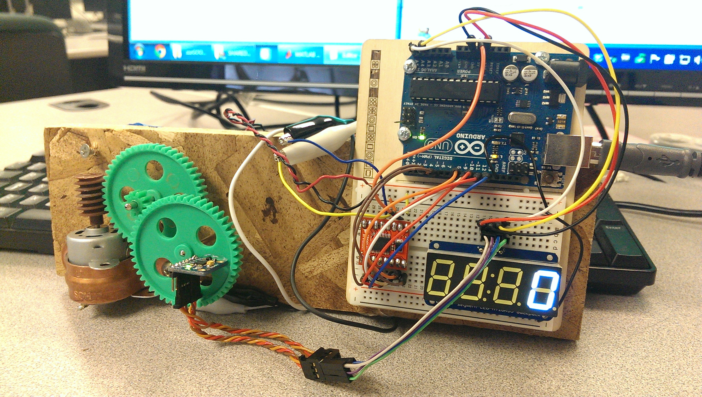
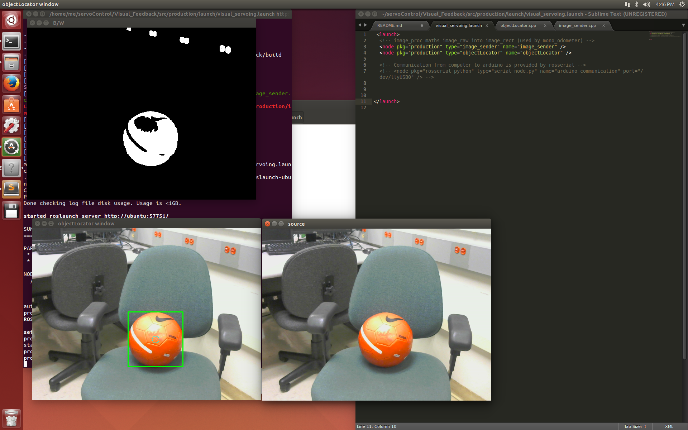

Custom Arduino PID servo control algorithm for brushed DC motor position control along with MATLAB analysis.

Two separate implementations are explored in this repository.

## IMU Feedback

servoControl Arduino code to run servo based on IMU feedback sensor.

## Visual Feedback:

Built using ROS (ros.org), ROS nodes are used for visual feedback system.
 * ojbect_locator node
    * Listens for incoming raw images in ROS. Callback uses OpenCV to locate orange objects within the images, and selects the center of the largest contiguous orange object in the frame. The system then broadcasts the size and location as a measurement to visualServo.ino. Color is determined using intensity thresholding. Object size is determined by using contour area properties.
 * basic octave prototype algorithm for object detection can be seen under objectLocator.m
 * visualServo.ino node
    * Arduino sketch that communicates with ROS using rosserial. This node computes the PID output of the system and sends motor commands to keep the orange object in the center of the screen.
